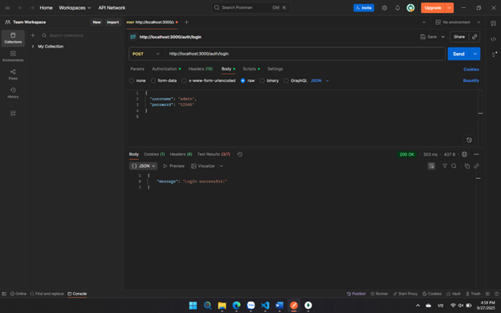
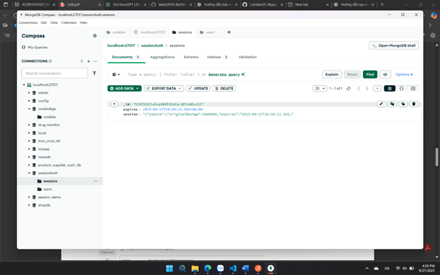
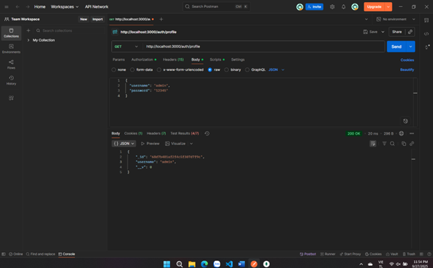
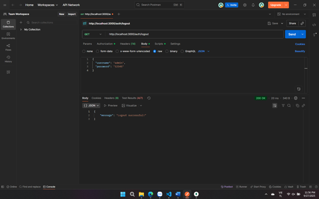

# Cookie Session Auth Example

## Mô tả
Đây là dự án Node.js sử dụng Express, MongoDB, session và cookie để xác thực người dùng.

## Cài đặt
1. Clone hoặc tải về dự án.
2. Chạy lệnh cài đặt các package:
   ```powershell
   npm install
   ```
3. Đảm bảo MongoDB đang chạy ở địa chỉ `mongodb://127.0.0.1:27017/sessionAuth`.
4. Khởi động server:
   ```powershell
   node app.js
   ```

## API và chức năng

### 1. Đăng ký tài khoản
- **URL:** `POST /auth/register`
- **Body:**
  ```json
  { "username": "admin", "password": "12345" }
  ```
- **Kết quả thành công:**



  ```json
  { "message": "User registered successfully!" }
  
  ```


### 2. Đăng nhập
- **URL:** `POST /auth/login`
- **Body:**
  ```json
  { "username": "admin", "password": "12345" }
  ```
- **Kết quả thành công:**

  ```json
  { "message": "Login successful!" }
  ```
  - Cookie `connect.sid` được trả về để xác thực phiên đăng nhập.



### 4. Đăng xuất
- **URL:** `GET /auth/logout`
- **Yêu cầu:** Đã đăng nhập (gửi kèm cookie `connect.sid`)
- **Kết quả thành công:**


 "Logout successful!" 
- **Lỗi:**
  - Nếu session không tồn tại hoặc có lỗi khi xóa session
  - Trả về:
    ```json
    { "error": "Logout failed" }